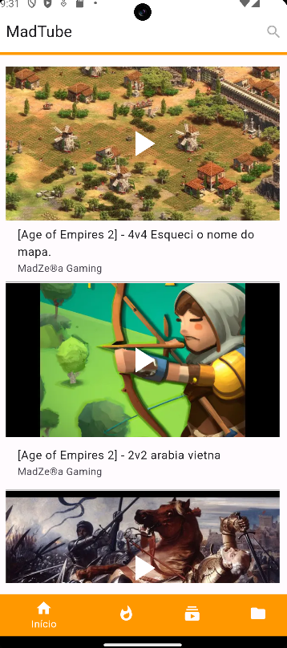
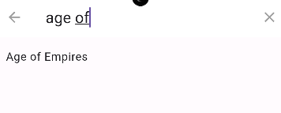

# MadTube

My own streaming channel in Youtube.

## Glossary

- [About the MadTube](#about-the-madtube)
- [User Guide](#user-guide)
- [Technical Requirements](#tecnical-requirements)
    - [Versions](#versions)

## About the MadTube

MadTube is a small learning project, overly simple with the sole purpose of practicing the Dart programming language along with the Flutter framework. Specifically, I created this project to practice asynchronous programming in Dart using widgets like FutureBuilder. Additionally, this project use a third-party lib to render the YouTube videos called **youtube_player_flutter**.

## User Guide
There are 5 functionalities (with only one made until now and I think that I won't continue =( ).

* **Start Page**
	Lists all videos from my channel in Youtube.
	
	
* **Search Videos**
	Search for videos (there are only fews pre defined keywords as search suggestions).
	
	
* **Highlighted Videos**
	Lists the most liked videos from my channel in Youtube.
* **Subscriptions**
	Offers options to setup the subscription.
* **Library**	
	Organize contents from video categories.
	
## Technical Requirements

The MadTube app works on both Android and iOS.

**For iOS, this app was not tested!** I don't have the means, and no, I won't use Hackintosh or rent some mac :)

### Versions

| Technology | Version |
|---|---|
| Android  | 14  |
| Android API Level  | 34  |
| Flutter  | 3.19.2  |
| Dart  | 3.3.0  |